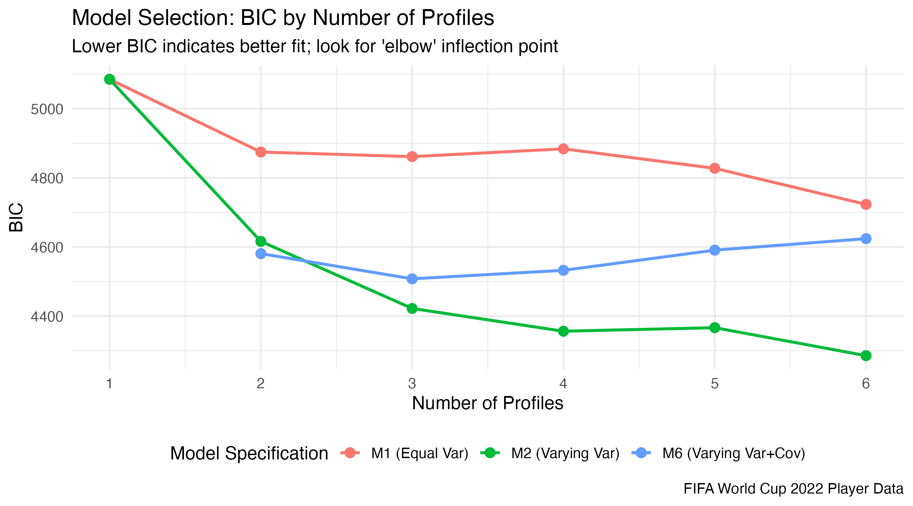
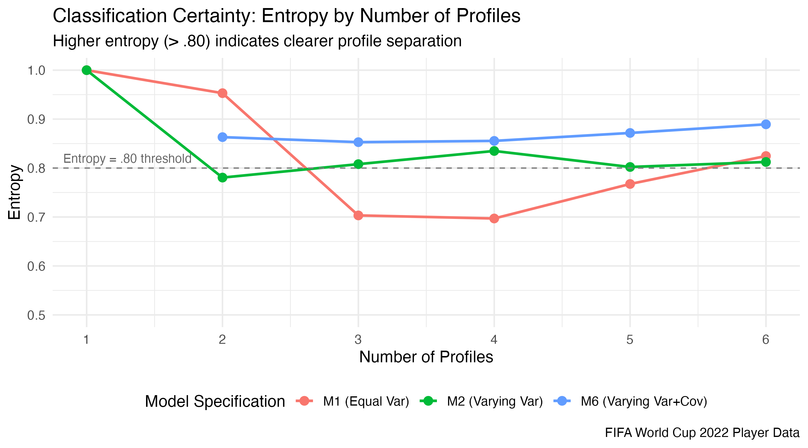
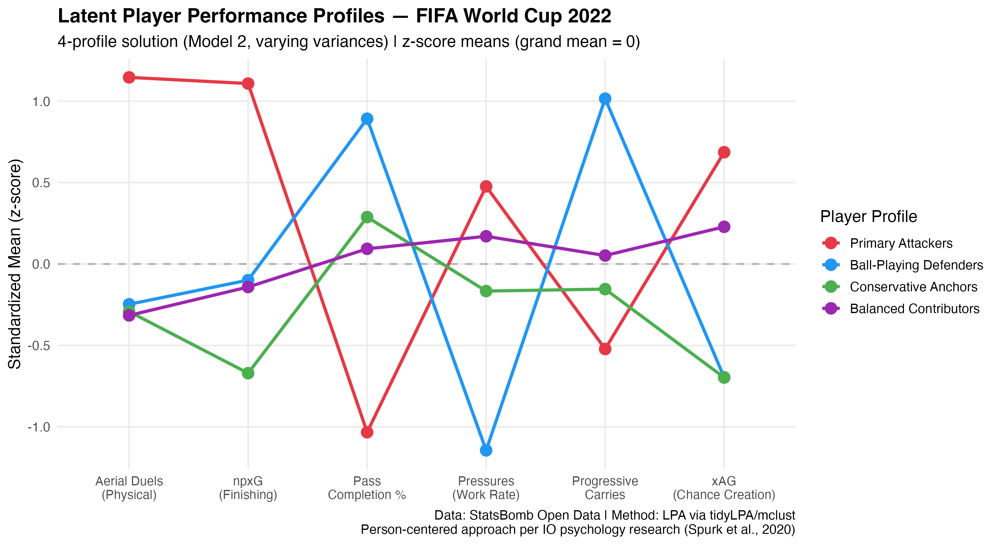
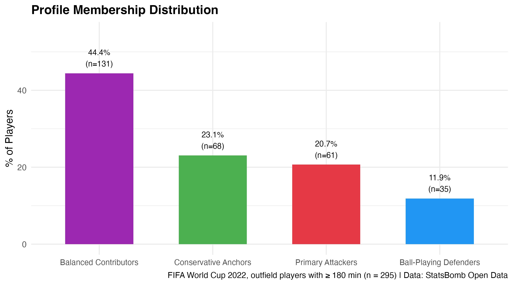
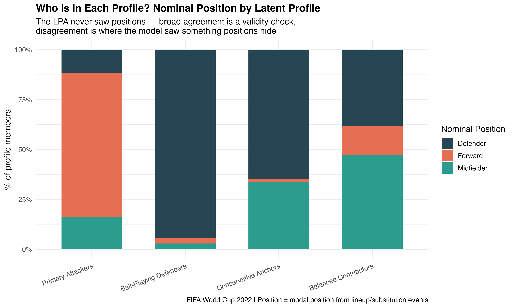
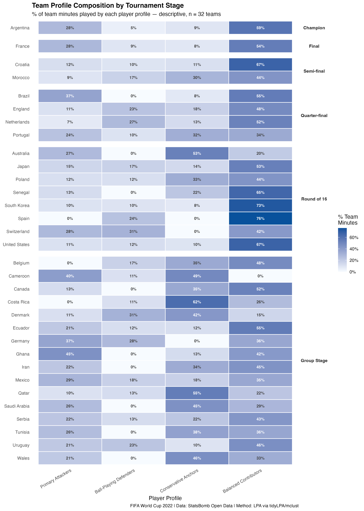

# World-Cup-2022-Latent-Profile-Analysis
Model-based clustering (tidyLPA/mclust) of 576 World Cup players on 6 game based metrics. Why use a Latent Profile Analysis? I chose it because cluster count and covariance structure are selected by fit indices (BIC, bootstrapped LRT, entropy) instead of guessed. This means that assignments come with posterior probabilities.


## TLDR
 
- Latent Profile Analysis of **295 outfield players** (≥180 minutes) at the 2022 World Cup, built from **StatsBomb event-level data** across all 64 matches, identified **four distinct player profiles**: Primary Attackers, Ball-Playing Defenders, Conservative Anchors, and Balanced Contributors.
- The model never saw a player's position, yet it recovered recognizable roles, filing Messi, Neymar, and Bruno Fernandes *with* Giroud and Lewandowski. This indicates that at the elite level, chance creation and finishing turned out to be one job, not two. The hypothesized "Creative Playmaker" type does not exist as a separate profile.
- The two 2022 finalists, Argentia and France, had nearly identical profile distributions (28% attacker minutes, majority Balanced Contributors), while no composition pattern cleanly separated advancing teams from eliminated ones: profile mix describes *how teams play*, not how far they go.
---
 
## Motivation
With a passion for soccer and people analytics, I saw an opportunity to apply people analytic methods in a sporting context. Given that soccer is a complex game that is often reduced to averages, I wanted to apply a more rigorous methodology to help make sense of the underlying data how teams play. 

In people analytics, variable-centered methods (regression, factor analysis) describe the *average* person: "does shooting accuracy predict goals?" However, person-centered methods like LPA ask: "**what kinds of people exist in this population?**" This mirrors a long line of IO psychology research on engagement profiles, burnout typologies, and team composition (Humphrey et al., 2007; Spurk et al., 2020). Looking at the data through this lens is also more useful question whenever teams rely on complementary types rather than interchangeable averages.
 
A World Cup is an unusually clean opportunity to deploy the method because it has a fixed elite talent pool, a shared performance context, and objective event-level measurement.
 
**Research questions**
 
1. How many distinct performance profiles exist among 2022 World Cup outfield players, and what characterizes them?
2. Do the profiles recovered by the model correspond to substantively meaningful footballing roles, and do they match what was hypothesized in advance?
3. How do teams differ in their profile composition?
---
 
## Data & Indicators
 
**Source:** StatsBomb Open DatA: This source contains every pass, shot, carry, pressure, and duel from all 64 matches. Player minutes were reconstructed from Starting XI and substitution events, capped at 90 per match (extra time excluded for opportunity consistency).
 
**Inclusion:** The analysis include players that logger ≥180 minutes played and ≥10 passes attempted. The analysis excluded goalkeepers. Final n = 295.
 
Six per-90 indicators spanning attack, creation, progression, defense, and technical reliability, each z-scored on the sample:
 
| Indicator | Definition |
|---|---|
| npxG/90 | Non-penalty expected goals |
| xAG/90 | Expected goals assisted |
| Progressive carries/90 | Carries advancing ≥~9 yards toward goal |
| Pressures/90 | Defensive pressing actions |
| Pass completion % | Completed ÷ attempted (set pieces excluded) |
| Aerial duels/90 | Contested aerials (see data note) |
 
> **Data note:** StatsBomb logs standalone aerial duels only as "Aerial Lost" events (wins are attributes of other events), so the aerial indicator undercounts won aerials and is best read as *aerial involvement*.
 
---
LPA solutions with 1–6 profiles were fit via `tidyLPA`/`mclust` under three variance-covariance specifications (M1: equal variances; M2: varying variances; M6: varying variances + covariances), following the model-selection framework standard in organizational research (Spurk et al., 2020; Nylund et al., 2007): BIC, entropy > .80, bootstrapped LRT, minimum profile size > 5%, and theoretical interpretability.
 
| Specification | k | BIC | Entropy | Smallest profile | Passes all criteria |
|---|---|---|---|---|---|
| M1 (equal var) | 5 | 4,828 | .77 | 4.7% | ✗ |
| M2 (varying var) | 3 | 4,422 | .81 | 28.8% | ✓ |
| **M2 (varying var)** | **4** | **4,356** | **.84** | **11.9%** | **✓** |
| M2 (varying var) | 5 | 4,367 | .80 | 14.9% | ✓ |
| M2 (varying var) | 6 | 4,286 | .81 | 8.1% | ✓ |
| M6 (varying var+cov) | 4 | 4,533 | .86 | 21.0% | ✓ |
 
**Selected: 4-profile, varying-variance solution (M2).** Within M2, BIC reaches a local minimum at k = 4 (4,356; k = 5 is *worse* at 4,367), entropy peaks at .84, the bootstrapped LRT is significant (p < .01), and every profile exceeds 10% of the sample. The 6-profile solution buys a lower BIC at the cost of weaker classification certainty, a near-threshold smallest profile, and two additional classes without clear substantive identity. The 3-profile solution collapses distinctions the 4-profile solution shows are real.
 

 


---
 
## Results: The Five Profiles


 
The profile plot is the core result: four lines that barely overlap, each with a distinct signature. Profile means on the original scale:
 
| Profile | n | % | npxG/90 | xAG/90 | Prog. carries/90 | Pressures/90 | Aerials/90 | Pass % |
|---|---|---|---|---|---|---|---|---|
| **Primary Attackers** | 61 | 20.7 | **0.23** | **0.13** | 2.33 | **14.8** | **3.09** | 70.7 |
| **Ball-Playing Defenders** | 35 | 11.9 | 0.08 | 0.01 | **6.29** | 6.20 | 1.34 | **88.3** |
| **Conservative Anchors** | 68 | 23.1 | 0.01 | 0.01 | 3.28 | 11.4 | 1.29 | 82.8 |
| **Balanced Contributors** | 131 | 44.4 | 0.08 | 0.09 | 3.81 | 13.2 | 1.26 | 81.0 |
 
**Primary Attackers (21%).** High on *both* finishing (npxG z ≈ +1.1) and creation (xAG z ≈ +0.7), the most aerially involved, and the least secure in possession (pass z ≈ −1.0), outputthat typically comes at the price of possession security. Highest-certainty members: Giroud, Lewandowski, Embolo; Messi, Mbappé, and Neymar classify here too. Note that npxG measures the quality of chances *accumulated*, not the conversion of these chances. This profile identifies players who consistently occupy high-value attacking situations and who have teammates that can get them into these high-value position.
 
**Ball-Playing Defenders (12%).** The most distinctive signature in the data: progressive carrying near +1 SD, the best passing (88.3%), and by far the *least* pressing (z ≈ −1.1), players who advance the ball into space nobody contests. Members: Stones, Maguire, Laporte, Tim Ream, and Rodri (who played the tournament at center-back for Spain).
 
**Conservative Anchors (23%).** Near-zero attacking output (npxG and xAG both ≈ 0.01/90) with slightly above-average passing security and unremarkable everything else. These are the low-risk stabilizers, full-backs and holding mids like Mooy, Krychowiak, and Hincapié whose job is to not lose the game.
 
**Balanced Contributors (44%).** The plurality profile: mildly above average in creation and pressing, mildly below in everything physical. Modrić, Marquinhos, Bernardo Silva, and Konaté all land here, genuinely excellent players whose contribution is spread too evenly for any single dimension to define them.
 


### The profile that refused to exist
 
Five types were hypothesized in advance, including a distinct "Creative Playmaker" defined by chance creation. It never emerged. In no solution did xAG dominate a profile on its own. Instead, the model filed the tournament's elite creators (Messi, Neymar, Bruno Fernandes, Griezmann) into the same profile as its pure finishers. The person-centered conclusion: at this level, *creating and taking high-value chances is one role, not two*. A variable-centered analysis could never have surfaced this, the xAG regression coefficient would have looked healthy either way.
 
### Validity check: profiles vs. positions
 

 
The model never saw positions, so agreement between profile and position is an external validity check. Any disagreement is useful information about the unique qualities of specific players. Ball-Playing Defenders are 94% nominal defenders; Primary Attackers are 72% forwards, with the "mismatches" being attacking midfielders (Neymar, Griezmann, Bruno Fernandes) whom the model grouped by function rather than formation slot. Across 295 players there are exactly two genuine anomalies. Steven Bergwijn and Granit Xhaka classifying as Ball-Playing Defenders. (Full crosstab: `profile_position_crosstab.csv`; anomalies: `profile_position_mismatches.csv`.)
 
---
 
## Team Composition: Style, Not Destiny
 
Aggregating profiles to minutes-weighted team shares gives every squad a compositional "fingerprint." With n = 32 teams this is deliberately descriptive, but the descriptive patterns are intriguing:
 

 
- **The two finalists were compositional twins.** Argentina and France both gave 28% of minutes to Primary Attackers and a majority (59% and 54%) to Balanced Contributors. They are the only two teams in the tournament with this combination.
- **Composition did not predict advancement.** Ghana gave 45% of minutes to attackers and went home in the group stage; Spain gave 0% and won its group before a Round-of-16 exit on penalties as the tournament's most Balanced-heavy side (76%). Attacker share among group-stage exits (22%) was virtually identical to the champion's (28%).
- **Anchor-heavy compositions cluster among underdogs.** Costa Rica (62%), Qatar (55%), and Cameroon (49%) devoted the most minutes to Conservative Anchors.  This is consistent with low-block, risk-minimizing game plans. These 3 teams failed to make it out of the group stage playing this style of soccer but Australia reached the knockouts with 53%, so even that pattern has exceptions.
- **Ball-Playing Defenders were a knockout-round staple but not a requirement:** 13 of 16 knockout teams fielded at least one, vs. 10 of 16 group-stage exits — and the champion's share was just 5%.
 
---
 
## Limitations
 
- Profiles describe *World Cup tournament behavior* per 90 minutes. This a compressed, tactically distinctive context and should not be read as stable player traits.
- The aerial indicator undercounts won duels (see data note).
- Players near the 180-minute floor have noisier per-90 rates than tournament ever-presents.
- npxG/xAG measure chance quality accumulated, not conversion skill; the attacker profile identifies chance-takers, not proven finishers.
- Team-level patterns are descriptive; n = 32 supports no inferential claims.
  
---
 
## Repository Structure
 
```
wc-player-profiles/
├── 01_soccer_data.R               # StatsBomb pull + player-minutes reconstruction
├── 02_metric_creation.R           # Event aggregation → 6 per-90 indicators, z-scoring
├── 03_lpa_model_selection.R       # 1–6 profile enumeration, 3 specifications, fit indices
├── 04_lpa_final_model.R           # Final 4-profile model, data-driven labeling, figures
├── 05_team_composition.R          # Minutes-weighted team profile mix
├── 05b_composition_descriptives.R # Heatmap, position crosstab, scarcity analysis
├── 06_outcome_prediction.R        # Exploratory outcome models (n = 32; descriptive)
└── codebook.md                    # variable definitions
```
 
Requirements: `tidyverse`, `tidyLPA`, `mclust`, `StatsBombR`, `here` (see `packages.R`). All models seeded (`set.seed(42)`).
 
---
 
## References
 
- Nylund, K. L., Asparouhov, T., & Muthén, B. O. (2007). Deciding on the number of classes in latent class analysis and growth mixture modeling. *Structural Equation Modeling*.
- Spurk, D., Hirschi, A., Wang, M., Valero, D., & Kauffeld, S. (2020). Latent profile analysis: A review and "how to" guide of its application within vocational behavior research. *Journal of Vocational Behavior*.
- Humphrey, S. E., Hollenbeck, J. R., Meyer, C. J., & Ilgen, D. R. (2007). Trait configurations in self-managed teams. *Journal of Applied Psychology*.
- Rosenberg, J. M., et al. (2018). tidyLPA: An R package to easily carry out latent profile analysis. *Journal of Open Source Software*.
- StatsBomb Open Data: https://github.com/statsbomb/open-data

## AI Disclosure
-This project was completed in collaboration with Claude.
 
